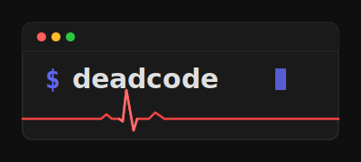
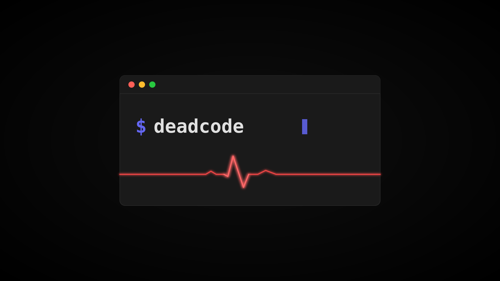

# Deadcode

<p align="center">
  
</p>

<p align="center">
  <strong>Debian Desktop Environment Configuration</strong>
</p>

<p align="center">
  A modular, idempotent installation system for setting up a complete i3-based desktop environment on Debian.
</p>

---

## Features

- **i3 Window Manager** with polybar, picom, rofi, and dunst
- **Multiple Color Themes** - Nord, Catppuccin, Gruvbox, and more
- **Plymouth Boot Splash** - Custom themed LUKS decryption screen
- **GNU Stow Integration** - Manage dotfiles with ease
- **Idempotent Scripts** - Safe to run multiple times
- **Whiptail TUI Menus** - User-friendly installation experience
- **Works on Debian Bookworm, Trixie, and beyond**

## Quick Start

### One-Line Install

```bash
curl -fsSL https://raw.githubusercontent.com/punkisdead/deadcode/main/install.sh | bash
```

### Manual Installation

```bash
git clone https://github.com/punkisdead/deadcode.git ~/.local/share/deadcode
cd ~/.local/share/deadcode
./setup.sh
```

## Requirements

- **Debian 12 (Bookworm)** or newer (Trixie, Sid)
- Fresh installation recommended (but not required)
- `sudo` access for package installation
- Internet connection for downloading packages

## What Gets Installed

### Core Components

| Category | Packages |
|----------|----------|
| Display Server | xorg, xserver-xorg, xinput, xbindkeys |
| Window Manager | i3, i3lock, i3status, sxhkd |
| Status Bar | polybar |
| Compositor | picom |
| Launcher | rofi |
| Notifications | dunst, libnotify |
| Terminals | alacritty, kitty |
| File Manager | thunar + plugins |
| Audio | pulseaudio, pavucontrol, pamixer |
| Bluetooth | bluez, blueman |
| Network | NetworkManager |
| Fonts | Nerd Fonts (JetBrains Mono, Fira Code, etc.) |
| Display Manager | LightDM |
| Boot Splash | Plymouth |

### Utility Commands

After installation, these commands are available:

| Command | Description |
|---------|-------------|
| `deadcode-menu` | Main TUI menu for configuration |
| `deadcode-theme-set <theme>` | Switch to a different color theme |
| `deadcode-theme-list` | List available themes |
| `deadcode-update` | Update deadcode and system packages |
| `deadcode-dotfiles-sync` | Sync and restow dotfiles |

## Themes

Deadcode includes several color themes that apply consistently across all applications:

| Theme | Description |
|-------|-------------|
| **nord** | Arctic, north-bluish color palette (default) |
| **catppuccin** | Catppuccin Mocha - soothing pastel dark theme |
| **catppuccin-latte** | Catppuccin Latte - soothing pastel light theme |
| **gruvbox** | Gruvbox Dark - retro groove color scheme |
| **gruvbox-light** | Gruvbox Light variant |
| **tokyo-night** | Clean dark theme inspired by Tokyo nights |
| **dracula** | Dark theme for vampires |
| **rose-pine** | All natural pine, faux fur and soho vibes |

### Switching Themes

```bash
# List available themes
deadcode-theme-list

# Switch to a theme
deadcode-theme-set catppuccin
```

Themes are applied to:
- i3 window decorations
- Polybar colors
- Rofi launcher
- Dunst notifications
- Terminal emulators (Alacritty, Kitty)

## Directory Structure

```
~/.local/share/deadcode/     # Installation directory
~/.config/deadcode/          # User configuration
  ├── themes/                # Installed themes
  └── current/
      └── theme -> ../themes/nord/   # Current theme symlink
~/dotfiles/                  # User dotfiles (managed by stow)
```

## Configuration

### Dotfiles Integration

Deadcode clones your dotfiles repository and uses GNU Stow to symlink configurations:

```bash
# Your dotfiles repo should have this structure:
dotfiles/
├── i3/.config/i3/
├── polybar/.config/polybar/
├── rofi/.config/rofi/
├── dunst/.config/dunst/
├── alacritty/.config/alacritty/
├── kitty/.config/kitty/
└── ...
```

To use your own dotfiles, set the `DOTFILES_REPO` environment variable before installing:

```bash
export DOTFILES_REPO="https://github.com/yourusername/dotfiles.git"
./setup.sh
```

### Customizing Package Lists

Package lists are stored in `packages/*.txt`. Edit these files to add or remove packages:

```bash
# Add a package to the utilities list
echo "your-package" >> ~/.local/share/deadcode/packages/utilities.txt
```

### Adding Custom Themes

Create a new theme directory with the following files:

```bash
~/.config/deadcode/themes/my-theme/
├── colors.sh       # Shell color variables
├── polybar.ini     # Polybar colors section
├── i3.conf         # i3 client colors
├── rofi.rasi       # Rofi theme
├── dunst.conf      # Dunst colors
├── alacritty.toml  # Alacritty colors
└── kitty.conf      # Kitty colors
```

## Plymouth Boot Splash

The custom deadcode Plymouth theme provides a branded boot experience with LUKS disk encryption password prompt.

<p align="center">
  
</p>

## Polybar Layout

The polybar configuration follows this layout:

```
┌─────────────────────────────────────────────────────────────────────┐
│ [Workspaces]          [Window Title]     [Net] [Time] [Vol] [Tray] │
└─────────────────────────────────────────────────────────────────────┘
```

- **Left**: i3 workspaces
- **Center**: Current window title
- **Right**: Network, date/time, volume, RAM, CPU, battery (if present), system tray

## Troubleshooting

### Display manager not starting

```bash
sudo systemctl status lightdm
sudo systemctl enable lightdm
```

### Polybar not appearing

```bash
# Restart polybar
killall polybar
~/.config/polybar/launch.sh
```

### Fonts not displaying correctly

```bash
# Rebuild font cache
fc-cache -fv
```

### WiFi slow/disconnecting

The installer disables WiFi power saving. If issues persist:

```bash
cat /etc/NetworkManager/conf.d/wifi-powersave-off.conf
# Should contain: wifi.powersave = 2
```

## Updating

```bash
deadcode-update
```

This will:
1. Pull the latest deadcode changes
2. Run any new migrations
3. Update system packages
4. Sync dotfiles

## Uninstalling

To remove deadcode-installed configurations (keeps packages):

```bash
rm -rf ~/.local/share/deadcode
rm -rf ~/.config/deadcode
# Optionally remove dotfiles symlinks
cd ~/dotfiles && stow -D */
```

## Contributing

Contributions are welcome! Please feel free to submit issues and pull requests.

## Credits

Inspired by:
- [drewgrif/bookworm-scripts](https://github.com/drewgrif/bookworm-scripts) - Modular Debian installation scripts
- [basecamp/omarchy](https://github.com/basecamp/omarchy) - Elegant Arch Linux setup with symlink-based theming

## License

MIT License - See [LICENSE](LICENSE) for details.

---

<p align="center">
  <sub>Made with terminal by <a href="https://github.com/punkisdead">@punkisdead</a></sub>
</p>
